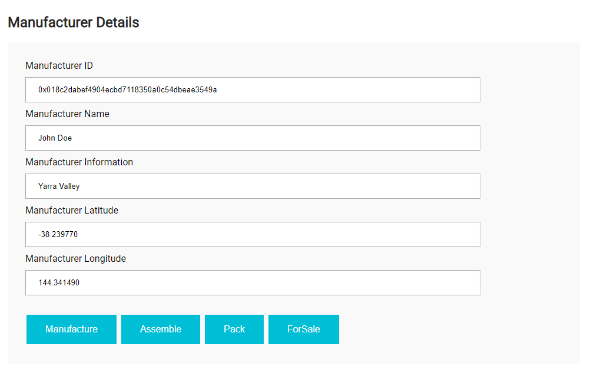
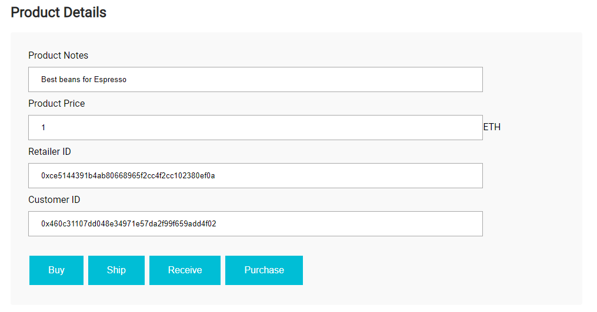
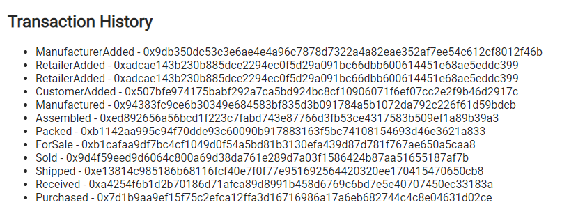

# Supply Chain & Data Auditing


This repository is based on the starter code provided by Udacity. You can clone it as follow:
```
git clone https://github.com/udacity/nd1309/tree/master/course-5/project-6
```

This repository containts an Ethereum DApp that demonstrates a Supply Chain flow between a Seller and Buyer. The user story is similar to any commonly used supply chain process. A Seller can add items to the inventory system stored in the blockchain. A Buyer can purchase such items from the inventory system. Additionally a Seller can mark an item as Shipped, and similarly a Buyer can mark an item as Received.

Here are some screenshots whe run the DApp








## UMLs

The following are the UMLs for Watches supply chain:

### Activity Diagram


### Sequence Diagram


### State Diagram


### Data Model Diagram


## Installing

Clone this repository:

```
git clone https://github.com/muradmm83/project6-blockchainnd
```

Change directory to ```project-6``` folder and install all requisite npm packages (as listed in ```package.json```):

```
cd project-6
npm install
```

Launch Ganache:

```
ganache-cli -m "spirit supply whale amount human item harsh scare congress discover talent hamster"
```


In a separate terminal window, Compile smart contracts:

```
truffle compile
```

This will create the smart contract artifacts in folder ```build\contracts```.

Migrate smart contracts to the locally running blockchain, ganache-cli:

```
truffle migrate
```

Test smart contracts:

```
truffle test
```

In a separate terminal window, launch the DApp:

```
npm run dev
```

## Contract Address

The contract was deployed to ```Rinkeby``` test network with the address of [0x57D6df48ACda3d450c4872a3B2A80F10c08De705](https://rinkeby.etherscan.io/address/0x57d6df48acda3d450c4872a3b2a80f10c08de705).